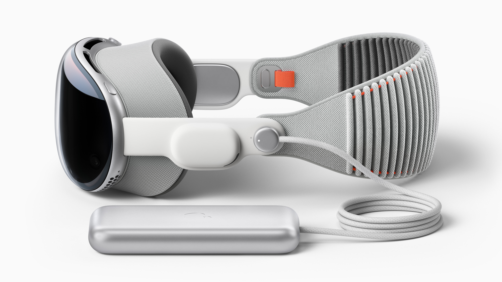

# Las gafas de Manovich

## Introducción

> (…) una aplicación de software o un proyecto/producto no son tan solo una remezcla de técnicas ya existentes, sino que también pueden introducir alguna(s) nueva(s), que luego pueden reaparecer en otras aplicaciones/productos. — Lev Manovich.[^1]

> A modo de ejemplo, aunque tan solo es uno entre muchísimos más, pensemos en la conocida aplicación de Google Earth, que combina técnicas de cartografía tradicional, conceptos del campo de los Sistemas de Información Geográfica (GIS, por su sigla en inglés), gráficos y animaciones por ordenador en 3D, software social, búsquedas y otros elementos o funciones. En mi opinión, esta capacidad de combinar técnicas de medios anteriormente diferenciadas marca una etapa esencialmente nueva en la historia de los medios humanos, la semiosis humana y la comunicación humana, facilitada por su «softwarización». — Lev Manovich.[^2]

Los medios ya no se limitan a existir de manera aislada, sino que se entrelazan y combinan entre sí. En El Software toma el mando, Manovich subraya este salto cualitativo tecnológico recalcando la forma en que los elementos visuales, sonoros y narrativos de la pintura, la fotografía, el diseño gráfico, la programación y otros medios convergen en creaciones híbridas y transdisciplinarias. Y lo ejemplifica con casos como Google Earth o en el menos conocido Aspen Movie Map. Un mapa ya no es simplemente papel impreso. Google Earth combina ahora fotografías aérea y satelital, imágenes 3D, gráficos generados por ordenador mezclados con fotografías reales. Una suma de medios que a su vez crea una representación híbrida de la realidad para interactuar con ella de nuevas maneras.

Pero El Software toma el mando es un libro publicado en 2013, hace una década, y si **seis meses** en tecnología **son un mundo**, **una década** entera **es otra galaxia completa a años luz de distancia**. Así que pongámonos las gafas de Manovich y aceptemos el reto de actualizar el concepto de hibridación con un par de ejemplos más recientes. Conozcamos algo más sobre los altavoces estrella de Amazon (Amazon Echo) y acerca de la visión futurista de la realidad extendida de Apple (Apple Visión Pro).

## Amazon Echo

Los dispositivos Amazon Echo son **altavoces inteligentes** desarrollados por el gigante de la logística Amazon, que integran en sus funciones el asistente personal de la compañía, Alexa. Gracias a este asistente, los Amazon Echo ofrecen una amplia gama de funciones y servicios mediante comandos de voz reduciendo al mínimo la interfaz física del altavoz y permitiendo, a su vez, interacciones más allá de las posibilidades clásicas de los altavoces tradicionales.

Donde antes un altavoz (bluetooth o cableado) servía simplemente para emitir audio, los Amazon Echo permanecen conectados a internet expandiendo sus funciones. Entre las tareas disponibles mediante **comandos de voz** se encuentran:
- la reproducción de música (tanto de servicios propios de la compañía como de terceros, Spotify, Apple Music, etc.),
- el control de otros dispositivos inteligentes del hogar (luces, termostatos, cerraduras, persianas…),
- la locución de noticias,
- la programación de recordatorios,
- infinidad de sorpresas (huevos de pascua como pedirle a Alexa que juegue contigo: *Alexa, piedra, papel o tijera*),[^3]
- y, por supuesto, encargar y comprar cualquier bien de consumo que la propia Amazon venda.
  
Los dispositivos Echo funcionan mediante el comando de activación *Alexa* seguido de la petición específica del usuario que se envía por internet y es procesada en los servidores de la compañía. Amazon ofrece además la posibilidad de personalizar y administrar sus dispositivos mediante de una aplicación móvil que completa el ecosistema Echo. Esta conexión continúa a internet, necesaria para volver inteligente al altavoz, plantea algunas incógnitas sobre la privacidad de las comunicaciones que establece, que, en cualquier caso, es común a todos los dispositivos inteligentes actuales.[^4]

La revolución de este tipo de aparatos parece sutil hoy en día, cuando nos rodean los electrodomésticos inteligentes y vivimos en casas domóticas, pero el salto cualitativo entre un objeto pasivo (el altavoz tradicional) y uno activo (el altavoz inteligente) es relevante. Por supuesto se trata de un caso claro de **hibridación de medios**.

> Las propiedades y técnicas exclusivas de distintos medios se han convertido en elementos de software que pueden combinarse por vías que antes resultaban imposibles. — Lev Manovich.[^5]

Aunque Manovich aquí se refería la máquina universal de medios de Alan Kay, cómo no, esta misma explicación puede aplicarse a los dispositivos Echo de Amazon. Antes una lista de la compra era una amalgama de letras tachadas en un papel arrugado y un altavoz se conectaba al equipo de música para escuchar un CD, un vinilo o la radio. Ahora, todos estos elementos tangibles coexisten en un mundo digital etéreo con el que nos relacionamos hablando: *Alexa, agrega detergente al carro de compra y después ponme algo de jazz*.

## Apple Vision Pro

En el comunicado de prensa para el anuncio de las gafas de realidad extendida de Apple, la compañía californiana define el concepto de las Vision Pro como «*una revolucionaria computadora espacial que fusiona el contenido digital con el mundo físico a la perfección y permite a los usuarios mantenerse presentes y en contacto con otras personas. Vision Pro crea un lienzo infinito que atraviesa las fronteras de una pantalla tradicional y presenta una interfaz completamente tridimensional operada por los controles más naturales e intuitivos que existen: los ojos, las manos y la voz de los usuarios*».[^6]

Auque a día de hoy estas gafas son todavía un prototipo y a fines prácticos habrá que esperar al lanzamiento en marzo de 2024 para comprobar cómo fusionan efectivamente el mundo real y el virtual, Apple hace que todo suene como si estuvieran inventando la rueda y no solo sacando su propia *visión* de la realidad mixta. Pero ¿qué son la realidad mixta o la realidad extendida?

### Realidades paralelas

**Realidad extendida** es un concepto paraguas que engloba el conjunto de tecnologías inmersivas de realidad virtual, realidad aumentada y realidad mixta. Suele ser referido por su acrónimo en inglés XR, de *extended reality*.[^7]

La **realidad virtual**(VR por sus siglas en inglés) coloca al usuario en un entorno netamente generado por ordenador en el que puede moverse gracias a controles externos como gafas integrales o guanteletes de acción. La VR es común en el mundo de los videojuegos si bien, a estas alturas, parece la más arcaica de todas las realidades extendidas.

La **realidad aumentada** (AR) superpone elementos digitales sobre el mundo real, sirviéndose comúnmente de las cámaras y pantallas de los dispositivos móviles. Su referente más popular es sin duda el juego japonés Pokémon Go!

La **realidad mixta** (MR) va un paso más allá. Se trata de una integración perfecta entre los gráficos virtuales y la imagen real. A diferencia de la realidad aumentada, en la MR los objetos virtuales reconocen y responden al entorno físico, no son un simple superpuesto.

> Apple Vision Pro también presenta EyeSight, una innovación extraordinaria que permite a los usuarios mantenerse en contacto con quienes los rodean. Cuando una persona se acerca a alguien que está usando Vision Pro, el dispositivo parece traslucirse, lo que permite al usuario ver a la persona que se está acercando y muestra los ojos del usuario. — Apple.

Por tanto, parece claro que la nueva apuesta de Apple es una realidad mixta (la suya propia), **hibridando no solo medios sino también espacios**.
> visionOS tiene una nueva interfaz tridimensional que crea la sensación de que el contenido digital está presente en el mundo físico del usuario. Como responde dinámicamente a la luz natural y produce sombras, ayuda al usuario a comprender la escala y la distancia. — Apple.

## Colofón

Reconoce Manovich, en las conclusiones de su libro El software toma el mando, que, si bien se ha centrado en analizar la evolución del software de creación y edición de medios, esta evolución está vinculada intrínsecamente al desarrollo paralelo del hardware.
> Más monitores de alta resolución, dispositivos de almacenado más grandes y más baratos, redes más rápidas, conectividad más sencilla entre dispositivos para la captura, almacenado, edición, distribución y reproducción de medios… Todos estos desarrollos amplían automáticamente las capacidades de los medios informáticos y alteran las posibilidades de la imaginación y el diseño.— Lev Manovich.[^8]

La conexión a internet de alta velocidad es necesaria para que los altavoces de Amazon sean inteligentes y funcionales creando nuevas rutinas en el usuario final.

El desarrollo de un nuevo hardware específico por parte de Apple incorpora software previo y lo adapta al nuevo medio reinventando nuevas formas de interactuar con él.

> Tras la primera fase de la invención del metamedio ordenador, pasamos a la próxima fase de la «hibridez» y la «remezclabilidad profunda» de los medios. «Las propiedades y técnicas exclusivas de distintos medios se han convertido en elementos de software que pueden combinarse por vías que antes resultaban imposibles.» «Tanto las tipologías de medios simuladas como las nuevas (texto, hipertexto, fotografías fijas, vídeo digital, animación en 2D y 3D, espacios navegables en 3D, mapas, información de localización) han pasado a funcionar como componentes de muchas nuevas combinaciones de medios. — Lev Manovich.[^9]

Empezaba este análisis diciendo que los medios ya no se limitan a existir de manera aislada, sino que se entrelazan y combinan entre sí. Terminaré igual.

## Licencias

### Licencia general
Este trabajo está realizado bajo una licencia [CC BY-NC 4.0](https://creativecommons.org/licenses/by-nc/4.0/ "Licencia CC BY-NC 4.0").

### Licencias de las imágenes
- Amazon Echo Dott: Imagen de [Finn](https://pixabay.com/es/users/finnhart-11150077/?utm_source=link-attribution&utm_medium=referral&utm_campaign=image&utm_content=4758340 "Finn") en [Pixabay](https://pixabay.com/es//?utm_source=link-attribution&utm_medium=referral&utm_campaign=image&utm_content=4758340 "Pixabay").
- Apple Vision Pro: Imagen proporcionada por Apple para fines personales, editoriales y no comerciales en el [comunicado de prensa del 5 de junio de 2023](https://www.apple.com/la/newsroom/2023/06/introducing-apple-vision-pro/ "Comunicado de prensa de las Apple Vision Pro"). Esta imagen no se puede alterar ni modificar de ninguna forma, ya sea en parte o en su totalidad, que pueda perjudicar a Apple.

[^1]:	Manovich, Lev. (2013). El Software toma el mando. (p. 186). Barcelona: Editorial UOC.

[^2]:	Manovich, Lev. (2013). El Software toma el mando (p. 52). Barcelona: Editorial UOC.

[^3]:	Fernández, Yúbal. (15 Enero 2021). 137 comandos para Alexa con los que exprimir al máximo tu Amazon Echo. [https://www.xataka.com/basics/137-comandos-para-alexa-que-exprimir-al-maximo-tu-amazon-echo](https://www.xataka.com/basics/137-comandos-para-alexa-que-exprimir-al-maximo-tu-amazon-echo)

[^4]:	Aguilar, Ricardo. (17 de noviembre de 2019). Cómo de espía es el altavoz inteligente: comparativa de condiciones y escándalos con Amazon, Google, Apple y Facebook. [https://www.xataka.com/privacidad/como-espia-altavoz-inteligente-comparativa-condiciones-escandalos-amazon-google-apple-facebook](https://www.xataka.com/privacidad/como-espia-altavoz-inteligente-comparativa-condiciones-escandalos-amazon-google-apple-facebook)

[^5]:	Manovich, Lev. (2013). El Software toma el mando (p. 141). Barcelona: Editorial UOC.

[^6]:	Apple España PR. (5 de junio de 2023). Presentamos Apple Vision Pro: la primera computadora espacial de Apple. [https://www.apple.com/la/newsroom/2023/06/introducing-apple-vision-pro/](https://www.apple.com/la/newsroom/2023/06/introducing-apple-vision-pro/)
	 

[^7]:	Weinstein, David. (26 de octubre de 2022). ¿Qué Es la Realidad Extendida? [https://la.blogs.nvidia.com/2022/10/26/que-es-la-realidad-extendida/](https://la.blogs.nvidia.com/2022/10/26/que-es-la-realidad-extendida/)

[^8]:	Manovich, Lev. (2013). El Software toma el mando. (p. 265). Barcelona: Editorial UOC.

[^9]:	Manovich, Lev. (2013). El Software toma el mando. (p. 268). Barcelona: Editorial UOC.
